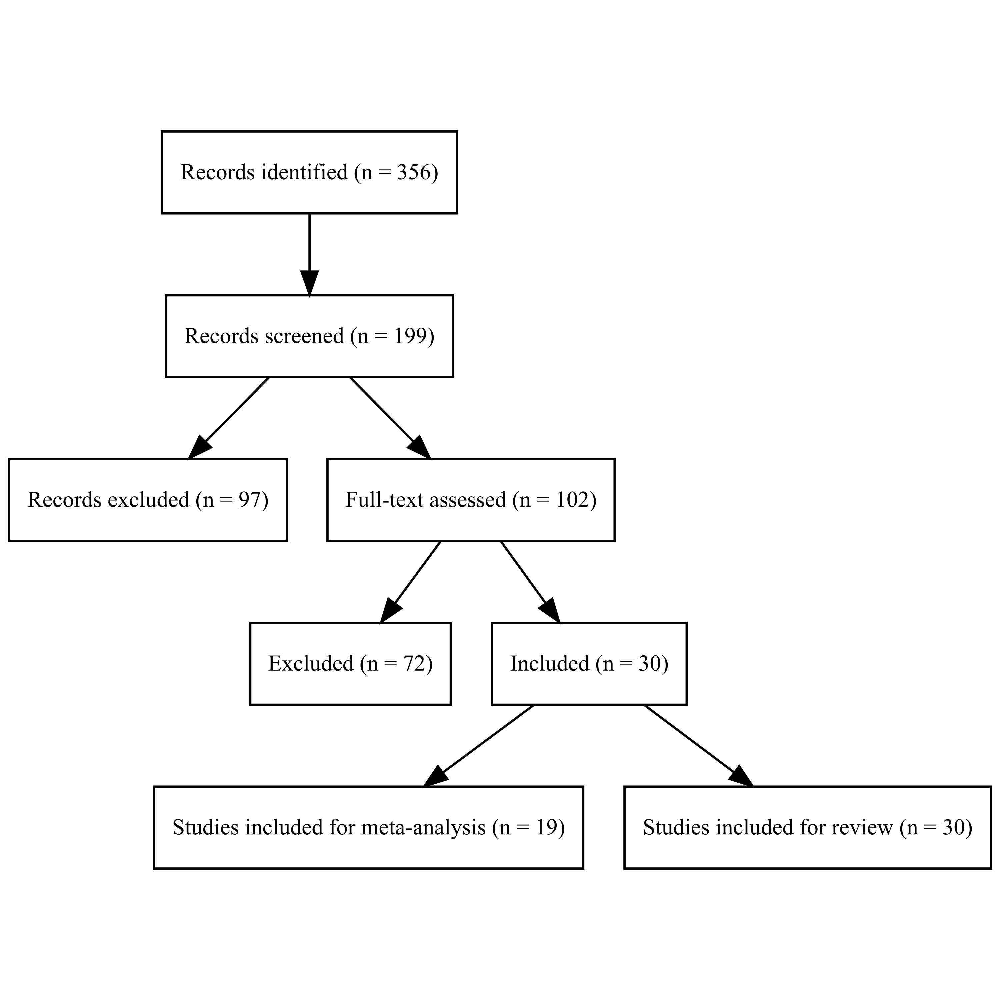

```{r}
#| labels: setup
source(here::here("R/utils.R"))

library(metafor)
library(ggplot2)
library(kableExtra)
library(flextable)

library(purrr)
library(metaSEM)

library(english)

library(readxl)
library(dplyr)
```

## Project overview

The *Living SEB Skills Project* is an ongoing initiative aimed at building a transparent, cumulative, and continuously updated resource for the study of **social, emotional, and behavioral (SEB) skills** [@sotoTakingSkillsSeriously2021]. Within this framework, SEB skills are organized into five broad domains: Self-management skills, which concern the capacity to plan, persist, and complete goal-directed tasks; Innovation skills, which reflect the ability to engage with new ideas and think creatively; Social engagement skills, which involve efficiently communicating and participating in social interactions; Cooperation skills, which support positive and constructive relationships with others; and Emotional resilience skills, which refer to the capacity to regulate emotions and cope effectively with stress and difficulties. Together, these domains provide an integrative way of studying skills that are often discussed under labels such as soft skills, social-emotional skills, or 21st-century skills.

The main goal of the *Living SEB Skills Project* is to make research in this area easier to monitor, synthesize, and use by maintaining a database that is updated regularly and organized so that new evidence can be incorporated over time. This makes it possible to track the development of the field, reduce fragmentation, and support a more cumulative and reproducible approach to research synthesis.

This monthly report is part of that broader effort. Its purpose is to provide an updated overview of the current state of the database and to summarize some of the main results that may emerge from the most recent release. Because the project follows a living approach, the contents of the database may expand over time as new studies become available and are screened, coded, and added to the resource. For this reason, the results reported here should be interpreted as the most up-to-date picture currently available rather than as a final or definitive summary of the literature.

The sections that follow first describe the data currently included in the project and then present selected results obtained from the latest version of the database.

# The Database

```{r}
#| label: countStudies
#| cache: true

library(RefManageR)
# sc1 <- ReadBib(here::here("data/0.bib_download/25_01_31_scopus.bib"))
# sc2 <- ReadBib(here::here("data/0.bib_download/25_04_30_scopus.bib"))
# ws1 <- ReadBib(here::here("data/0.bib_download/25_01_31_wos.bib"))
# ws2 <- ReadBib(here::here("data/0.bib_download/25_04_30_wos.bib"))
# totSc <- sum(c(length(sc1),length(sc2)))
# totWs <- sum(c(length(ws1),length(ws2)))
# totDownload <- totSc + totWs

bib_dir <- here::here("data/0.bib_download")

# files
scopus_files <- list.files(
  bib_dir,
  pattern = "scopus\\.bib$",
  full.names = TRUE
)

wos_files <- list.files(
  bib_dir,
  pattern = "wos\\.bib$",
  full.names = TRUE
)

# read and store
scopus_bibs <- setNames(lapply(scopus_files, ReadBib), basename(scopus_files))
wos_bibs    <- setNames(lapply(wos_files, ReadBib), basename(wos_files))

# number of entries in each file
scopus_n <- lengths(scopus_bibs)
wos_n    <- lengths(wos_bibs)

# partial totals
totSc <- sum(scopus_n)
totWs <- sum(wos_n)

# grand total
totDownload <- totSc + totWs

```

```{r}
#| label: generalData
admcol <- readxl::read_excel(here::here("data/matrix_codebook.xlsx"))
varlist <- admcol[complete.cases(admcol[,1:4]),] # List of the variables that can be used with different grain [Topic, BROAD, specific, and label]
labels_app <- setNames(varlist$label, varlist$column_name) # Create a named vector from the lookup table

```

```{r}
#| label: metaData

metaData <- readxl::read_excel(here::here("data/3.meta_data/meta_data/metadata.xlsx"))
nMetaPapers <- length(unique(metaData$paper_id))
nMetaSamples <- length(unique(metaData$matrix_id))
minSampleSize <- min(metaData$n)
maxSampleSize <- max(metaData$n)
medSampleSize <- median(metaData$n)

subMeta <- subset(metaData,select = -c(download_date:additional))

nTotCor <- ncol(metaData)-ncol(subset(metaData,select = c(download_date:additional)))
nTotEff <- sum(!is.na(subset(metaData,select = -c(download_date:additional))))

# SEB effects
library(dplyr)
bessiVars <- admcol$column_name[admcol$broad %in% c("BESSI","BESSI_facet")]
bessiCorPattern <- paste(bessiVars, collapse = "|")   # "varA|varC"
df_BessiSubset <- metaData %>% select(matches(bessiCorPattern))

nTotBessiCor <- ncol(df_BessiSubset)
nTotBessiEff <- sum(!is.na(df_BessiSubset))
```

```{r}
#| label: reviewData
reviewData <- readxl::read_excel(here::here("data/3.meta_data/review_data/review_data.xlsx"))
nReviewPapers <- nrow(reviewData)
```

At the time of writing, the systematic search identified `r totDownload` publications (Scopus = `r totSc`; WOS = `r totWs`). After removing duplicates, screening titles and abstracts, and reviewing full texts, `r nReviewPapers` studies were retained for the living review and `r nMetaPapers` studies met criteria for quantitative synthesis. These include a total of `r nMetaSamples` independent samples (see @fig-prisma), with sample sizes ranging from `r minSampleSize` to `r maxSampleSize` (median = `r medSampleSize`).

Across these studies, a total of `r nTotEff` correlation coefficients were coded, representing `r nTotCor` unique pairwise associations. Of these, `r nTotBessiEff` correlations (`r nTotBessiCor` unique associations) involved at least one SEB domain or facet measured with a BESSI instrument.

```{r}
#| label: prisma-fig-prisma
#| fig-cap: "PRISMA flow chart"
#| echo: false
#| message: false
#| warning: false
#| results: "hide"

library(here)
library(readxl)
library(glue)
library(DiagrammeR)
library(DiagrammeRsvg)
library(rsvg)

# ------------------------------ Inputs / counts
records_identified <- totDownload

# Abstract screening
screened_files <- list.files(here("data/1.abstracting"), pattern = "\\.xlsx$", full.names = TRUE)
records_screened <- screened_files |>
  lapply(read_excel) |>
  lapply(nrow) |>
  unlist() |>
  sum()

# Full-text screening
full_screen_files <- list.files(here("data/2.full_abstracting"),
                                pattern = "fullabstracting.*\\.xlsx$", full.names = TRUE)
records_fullabstracting <- full_screen_files |>
  lapply(read_excel) |>
  lapply(nrow) |>
  unlist() |>
  sum()

# Included
# NOTE: make sure 'metaData' exists; otherwise replace with the right object.
included_total <- length(unique(c(metaData$paper_id, reviewData$paper_id)))
included_meta  <- nMetaPapers
included_review <- nReviewPapers

# Excluded
abstract_exclude  <- records_screened - records_fullabstracting
fulltext_exclude  <- records_fullabstracting - included_total

# ------------------------------ Graphviz code via glue with safe delimiters
prisma_code <- glue(
"
digraph prisma {{
  graph [bgcolor = white]

  node [shape = box, style = filled, fillcolor = white, fontname = 'Times New Roman', fontsize = 10]

  A [label = 'Records identified (n = <<records_identified>>)']
  B [label = 'Records screened (n = <<records_screened>>)']
  C [label = 'Records excluded (n = <<abstract_exclude>>)']
  D [label = 'Full-text assessed (n = <<records_fullabstracting>>)']
  E [label = 'Excluded (n = <<fulltext_exclude>>)']
  F [label = 'Included (n = <<included_total>>)']
  G [label = 'Studies included for meta-analysis (n = <<included_meta>>)']
  H [label = 'Studies included for review (n = <<included_review>>)']

  A -> B -> C
  B -> D -> E
  D -> F -> G
  F -> H
}}
",
  .open = "<<", .close = ">>"
)

# ------------------------------ Render SVG -> PNG/PDF
g <- DiagrammeR::grViz(prisma_code)

svg_raw <- charToRaw(DiagrammeRsvg::export_svg(g))
rsvg_pdf(svg_raw,  file = "prisma.pdf")
rsvg_png(svg_raw,  file = "prisma.png", width = 3000, height = 3000)  # hi-res

```

{#fig-prisma}

# Gender Differences

Using the correlations available, it is possible to gauge information also on group differences. To do so, we use a three-level random-effects model.

Because gender was coded 0 = male and 1 = female, positive correlations indicate higher scores among females, whereas negative correlations indicate higher scores among males.

```{r}
#| label: gender-scripts

# Variables of interest
study_info <- c("download_date","doi","year","age_class",
                "paper_id","matrix_id", 
                "author_et_al","n","title")
pred_vars <- sort(c("selfmanagement","cooperation","socialengagement", 
                    "innovation", "emotionalresilience"))
out_vars <- "sex"
# Get the data in good format
dm <- getMETAdata(pred_vars, out_vars, metaData, study_info)
# Compute effect sizes
dm <- escalc(measure = "ZCOR", ri = value, ni = n, data = dm)

# Descriptive stats of the data
uniqueD <- dm[!duplicated(dm$matrix_id), ]
metaStudyTab <- data.frame(
  StudyID = uniqueD$matrix_id, 
  Authors = uniqueD$author_et_al,
  Year = as.character(uniqueD$year),
  Age = uniqueD$age_class,
  N = as.character(uniqueD$n),
  doi = uniqueD$doi
)
metaStudy_table <- rbind(
  metaStudyTab,
  c("Total","","","",sum(as.numeric(metaStudyTab$N)),"")
)

# Meta-analysis    
outList <- list()
metaCol <- c("b","cil","ciu","se","z","p",
             "r","rcil","rciu","rpil","rpiu",
             "tau2",
             "k","N",
             "q","qdf","qp")
metaRes <- matrix(nrow = length(pred_vars), ncol = length(metaCol))
colnames(metaRes) <- metaCol
rownames(metaRes) <- pred_vars

for (i in 1:length(pred_vars)) {
  di <- dm[dm$pred == pred_vars[i] & is.na(dm$yi) == F,]
  outList[[i]] <- rma.mv(yi = yi, V = vi, random = ~ 1 | paper_id / matrix_id,
                         test = "t", data = di)
  mres <- summary(outList[[i]])
  pred <- predict(mres, transf=transf.ztor)
  tau2 <- sum(mres$sigma2)
  metaRes[i,] <- c(mres$beta,mres$ci.lb,mres$ci.ub,mres$se,mres$zval,mres$pval,
                   pred$pred,pred$ci.lb,pred$ci.ub,pred$pi.lb,pred$pi.ub,
                   tau2,
                   nrow(di),sum(di$n[di$matrix_id %in% unique(di$matrix_id)]),
                   mres$QE,mres$QEdf,mres$QEp
                   )
}
names(outList) <- pred_vars
metaRes <- data.frame(metaRes)
metaRes$skill = pred_vars     

pcrit <- 0.01
```

A total of `r nrow(dm)` effect sizes from `r length(unique(dm$paper_id))` studies and `r length(unique(dm$matrix_id))` samples were included. For each SEB domain, the median available sample size was `r median(dm$n)` (minimum sample size = `r min(dm$n)`; maximum sample size = `r max(dm$n)`).

The full set of results is available in @tbl-gender-results and @fig-gender-analysis-plot.

```{r}
#| label: tbl-gender-results
#| tbl-cap: Meta-analytical associations between SEB skills and Biological Sex
#| apa-note: \\* *p* < .05; \\*\\* *p* < .01; \\*\\*\\* *p* < .001; CI = Confidence intervals; PI = Prediction intervals; se = Standard error

metaResTable <- data.frame(
  Skill = metaRes$skill,
  N = paste0(metaRes$N, " (", metaRes$k, ")"),
  r = paste0(format(round(metaRes$r, 2),nsmall=2),
             ifelse(metaRes$p < .001, "***",
                    ifelse(metaRes$p < .01, "**",
                           ifelse(metaRes$p < .05, "*", "")))),
  CI = paste0(format(round(metaRes$rcil,2),nsmall=2),"; ",
              format(round(metaRes$rciu,2),nsmall=2)),
  PI = paste0(format(round(metaRes$rpil,2),nsmall=2),"; ",
              format(round(metaRes$rpiu,2),nsmall=2)),
  se = format(round(metaRes$se,2),nsmall=2),
  # p = format(round(metaRes$p,4),3),
  q = paste0(round(metaRes$q), " (",metaRes$qdf,")",
             ifelse(metaRes$qp < .05, "*",
                    ifelse(metaRes$qp < .01, "**",
                           ifelse(metaRes$qp < .001, "***","")))),
  tau2 = format(round(metaRes$tau2,2),nsmall=2))

# Replace factor levels
metaResTable$Skill <- labels_app[as.character(metaResTable$Skill)]
metaResTable <- as.data.frame(metaResTable)
metaResTable |>
  flextable() |>
  theme_apa() |>
  valign(valign = "top") |>
  autofit() |>
  set_header_labels(N = "N (k)")
#kable(metaResTable)
```

```{r}
#| label: fig-gender-analysis-plot
#| fig-cap: "Meta-analytical associations between the five SEB domains and Biological Sex."

# outcomemeta <- "academicachievement"
# outcomelabel <- varlist$label[varlist$column_name == outcomemeta]
metaRes$skill <- labels_app[as.character(metaRes$skill)]
metaRes$CI <- paste0("[",format(round(metaRes$rcil,3),nsmall=3),"; ",
                     format(round(metaRes$rciu,3),nsmall=3),"]")

ggplot(metaRes, aes(x = r, y = reorder(skill,length(pred_vars):1))) +
  geom_point(shape = 18,
             color = "black",
             size = 4) +
  geom_errorbar(aes(xmin = rcil, xmax = rciu), width = 0, linewidth = .8) +
  geom_vline(xintercept = c(.00), linetype = "dashed") +
  labs(y = element_blank()) +
  scale_x_continuous(breaks = seq(-.10,.50,by=.10),
                       name = expression("Back-transformed " * hat(r))) +
  theme_bw(base_size = 16) +
  #theme(strip.text = element_text(size = 1)) +
  annotate("text", 
           x = metaRes$r,
           y = length(pred_vars):1+.20,
           label = paste0(round(metaRes$r,3)," ",metaRes$CI), 
           hjust = "center", size = 5) +
  coord_cartesian(xlim = c(ifelse(min(metaRes$rcil) > -.05, -.10,
                                  min(metaRes$rcil)),
                           max(metaRes$rciu)))

```

Of the five meta-analysed correlations with biological sex, `r as.character(english(sum(metaRes$r>.10 | metaRes$r< -.10)))` were larger than |0.10|, with significant effects (p \< `r pcrit`) ranging between `r round(min(metaRes$r[metaRes$p<pcrit]),2)` (i.e., `r metaRes$skill[which.min(ifelse(metaRes$p < pcrit, metaRes$r, Inf))]`) and `r round(max(metaRes$r[metaRes$p<.05]),2)` (i.e., `r metaRes$skill[which.max(metaRes$r)]`).


# SEB Skills and Academic Achievement

Onother interesting question we may tackle using the *Living SEB Skills Project*'s database, is **do SEB skills matter for academic achievement**.

We Try to answer this question at three different levels:

-   Are SEB skills singularly associated with academic achievement?
-   Do SEB skills predict academic achievement beyond the Big Five?
-   Does any specific skill show incremental validity beyond the other skills?

## The Association Between SEB Skills and Academic Achievement

To test the bivariate associations between the five SEB skill domains and academic achievement, we use a three-level random-effects model.

```{r}
#| label: meta-analysis-scripts

# Variables of interest
study_info <- c("download_date","doi","year","age_class",
                "paper_id","matrix_id", 
                "author_et_al","n","title")
pred_vars <- sort(c("selfmanagement","cooperation","socialengagement", 
                    "innovation", "emotionalresilience"))
out_vars <- "academicachievement"
# Get the data in good format
dm <- getMETAdata(pred_vars, out_vars, metaData, study_info)
# Compute effect sizes
dm <- escalc(measure = "ZCOR", ri = value, ni = n, data = dm)

# Descriptive stats of the data
uniqueD <- dm[!duplicated(dm$matrix_id), ]
metaStudyTab <- data.frame(
  StudyID = uniqueD$matrix_id, 
  Authors = uniqueD$author_et_al,
  Year = as.character(uniqueD$year),
  Age = uniqueD$age_class,
  N = as.character(uniqueD$n),
  doi = uniqueD$doi
)
metaStudy_table <- rbind(
  metaStudyTab,
  c("Total","","","",sum(as.numeric(metaStudyTab$N)),"")
)

# Meta-analysis    
outList <- list()
metaCol <- c("b","cil","ciu","se","z","p",
             "r","rcil","rciu","rpil","rpiu",
             "tau2",
             "k","N",
             "q","qdf","qp")
metaRes <- matrix(nrow = length(pred_vars), ncol = length(metaCol))
colnames(metaRes) <- metaCol
rownames(metaRes) <- pred_vars

for (i in 1:length(pred_vars)) {
  di <- dm[dm$pred == pred_vars[i] & is.na(dm$yi) == F,]
  outList[[i]] <- rma.mv(yi = yi, V = vi, random = ~ 1 | paper_id / matrix_id,
                         test = "t", data = di)
  mres <- summary(outList[[i]])
  pred <- predict(mres, transf=transf.ztor)
  tau2 <- sum(mres$sigma2)
  metaRes[i,] <- c(mres$beta,mres$ci.lb,mres$ci.ub,mres$se,mres$zval,mres$pval,
                   pred$pred,pred$ci.lb,pred$ci.ub,pred$pi.lb,pred$pi.ub,
                   tau2,
                   nrow(di),sum(di$n[di$matrix_id %in% unique(di$matrix_id)]),
                   mres$QE,mres$QEdf,mres$QEp
                   )
}
names(outList) <- pred_vars
metaRes <- data.frame(metaRes)
metaRes$skill = pred_vars     

pcrit <- 0.01
```

A total of `r nrow(dm)` effect sizes from `r length(unique(dm$paper_id))` studies and `r length(unique(dm$matrix_id))` samples were included. For each SEB domain, the median available sample size was `r median(dm$n)` (minimum sample size = `r min(dm$n)`; maximum sample size = `r max(dm$n)`).

The full set of results is available in @tbl-meta-results and @fig-meta-analysis-plot.

```{r}
#| label: tbl-meta-results
#| tbl-cap: Meta-analytical associations between SEB skills and academic achievement
#| apa-note: \\* *p* < .05; \\*\\* *p* < .01; \\*\\*\\* *p* < .001; CI = Confidence intervals; PI = Prediction intervals; se = Standard error

metaResTable <- data.frame(
  Skill = metaRes$skill,
  N = paste0(metaRes$N, " (", metaRes$k, ")"),
  r = paste0(format(round(metaRes$r, 2),nsmall=2),
             ifelse(metaRes$p < .001, "***",
                    ifelse(metaRes$p < .01, "**",
                           ifelse(metaRes$p < .05, "*", "")))),
  CI = paste0(format(round(metaRes$rcil,2),nsmall=2),"; ",
              format(round(metaRes$rciu,2),nsmall=2)),
  PI = paste0(format(round(metaRes$rpil,2),nsmall=2),"; ",
              format(round(metaRes$rpiu,2),nsmall=2)),
  se = format(round(metaRes$se,2),nsmall=2),
  # p = format(round(metaRes$p,4),3),
  q = paste0(round(metaRes$q), " (",metaRes$qdf,")",
             ifelse(metaRes$qp < .05, "*",
                    ifelse(metaRes$qp < .01, "**",
                           ifelse(metaRes$qp < .001, "***","")))),
  tau2 = format(round(metaRes$tau2,2),nsmall=2))

# Replace factor levels
metaResTable$Skill <- labels_app[as.character(metaResTable$Skill)]
metaResTable <- as.data.frame(metaResTable)
metaResTable |>
  flextable() |>
  theme_apa() |>
  valign(valign = "top") |>
  autofit() |>
  set_header_labels(N = "N (k)")
#kable(metaResTable)
```

```{r}
#| label: fig-meta-analysis-plot
#| fig-cap: "Meta-analytical associations between the five SEB domains and academic achievement."

# outcomemeta <- "academicachievement"
# outcomelabel <- varlist$label[varlist$column_name == outcomemeta]
metaRes$skill <- labels_app[as.character(metaRes$skill)]
metaRes$CI <- paste0("[",format(round(metaRes$rcil,3),nsmall=3),"; ",
                     format(round(metaRes$rciu,3),nsmall=3),"]")

ggplot(metaRes, aes(x = r, y = reorder(skill,length(pred_vars):1))) +
  geom_point(shape = 18,
             color = "black",
             size = 4) +
  geom_errorbar(aes(xmin = rcil, xmax = rciu), width = 0, linewidth = .8) +
  geom_vline(xintercept = c(.00), linetype = "dashed") +
  labs(y = element_blank()) +
  scale_x_continuous(breaks = seq(-.10,.50,by=.10),
                       name = expression("Back-transformed " * hat(r))) +
  theme_bw(base_size = 16) +
  #theme(strip.text = element_text(size = 1)) +
  annotate("text", 
           x = metaRes$r,
           y = length(pred_vars):1+.20,
           label = paste0(round(metaRes$r,3)," ",metaRes$CI), 
           hjust = "center", size = 5) +
  coord_cartesian(xlim = c(ifelse(min(metaRes$rcil) > -.05, -.10,
                                  min(metaRes$rcil)),
                           max(metaRes$rciu)))

```

Of the five meta-analysed correlations with academic achievement, `r as.character(english(sum(metaRes$r>.10)))` were larger than 0.10, with significant effects (p \< `r pcrit`) ranging between `r round(min(metaRes$r[metaRes$p<pcrit]),2)` (i.e., `r metaRes$skill[which.min(ifelse(metaRes$p < pcrit, metaRes$r, Inf))]`) and `r round(max(metaRes$r[metaRes$p<.05]),2)` (i.e., `r metaRes$skill[which.max(metaRes$r)]`).

## SEB Skills or Big Five Traits?

Using one-stage meta-analytic structural equation modelling (OSMASEM) procedures [@jak2020MetaanalyticStructuralEquation], five saturated regression models were estimated, each including one SEB domain and its matched Big Five trait as predictors of academic achievement.


```{r}
#| label: masem-initial-scripts
#| cache: true

study_info <- c("download_date","doi","year","age_class",
                "paper_id","matrix_id", 
                "author_et_al","n","title")
target_vars <- sort(c("selfmanagement","cooperation","socialengagement", 
                      "innovation", "emotionalresilience",
                      "conscientiousness","agreeableness","extraversion",
                      "openness","neuroticism",
                      "academicachievement"
                      ))
# Get the data in good format
metaD<-getSEMdata(target_vars,metaData,study_info)

ktab <- pattern.na(metaD$cor_matrices, show.na = FALSE) 
ntab<-pattern.n(metaD$cor_matrices, metaD$basic_info$n) 

StudyTab <- data.frame(
    # Dataset = metaD()$basic_info$download_date,
    StudyID = metaD$basic_info$matrix_id,
    Authors = metaD$basic_info$author_et_al,
    Year = as.character(metaD$basic_info$year),
    Age = as.character(metaD$basic_info$age_class),
    N = metaD$basic_info$n,
    doi = metaD$basic_info$doi)

```

```{r}
#| label: tssem-scripts
#| cache: true
#| eval: false

cfa1 <- metaSEM::tssem1(metaD$cor_matrices, metaD$basic_info$n)
x <- round(metaSEM::vec2symMat(coef(cfa1,"fixed"),diag=FALSE),2)
dimnames(x) <- list(paste0(rownames(metaD$cor_matrices[[1]])),
                    paste0(rownames(metaD$cor_matrices[[1]])))
```

```{r}
#| label: tssem-summary
#| eval: false
new_order <- c("selfmanagement","cooperation","socialengagement", 
                      "innovation", "emotionalresilience",
                      "conscientiousness","agreeableness","extraversion",
                      "openness","neuroticism",
                      "academicachievement"
                      )
x_reordered <- x[new_order, new_order]

dimnames(x_reordered) <- list(
  labels_app[rownames(x_reordered)],
  labels_app[colnames(x_reordered)]
)

SumTable <- x_reordered
dimnames(SumTable) <- list(paste0(1:nrow(SumTable),".",rownames(SumTable)),
                           paste0(1:nrow(SumTable),"."))

```

MASEM analyses were based on varying number of effect sizes per pairwise correlation (i.e., different correlation matrices), with the minimum available effects per correlation being `r min(ktab)` and the maximum being `r max(ktab)`. As a consequence, also sample sizes and precision differed, with the minimum being `r min(ntab)` (i.e., correlations between personality traits and academic achievement) and the maximum being `r as.character(max(ntab))` (i.e., correlations between SEB domains). Correlation matrices were taken from `r length(unique(metaD$basic_info$matrix_id))` samples included in `r length(unique(metaD$basic_info$paper_id))` different studies.

Given the low number of studies available for some variables, we set between-study variance to zero and estimated a common effect across studies. This approach avoids attempting to estimate random‐effects components that would be unstable or poorly identified in sparse conditions.

```{r}
#| label: tbl-pooled-cor
#| include: false
#| tbl-cap: Pooled correlation matrix
#| eval: false
# apa-note:
#   - Pooled correlations are based on different sample sizes and effects and their precision may vary

pooledTab <- as.data.frame(SumTable)
pooledTab$Variable <- rownames(pooledTab)
rownames(pooledTab) <- NULL
pooledTab <- pooledTab[,c(ncol(pooledTab),1:(ncol(pooledTab)-1))]

# kable(pooledTab)
pooledTab |>
  flextable() |>
  set_caption(caption = "") |>
  theme_apa() |>
  valign(valign = "top") |>
  padding(part = "all", padding = 1) |>
  fontsize(size = 10, part = "all") |>
  autofit()
```

```{r}
#| label: fig-corrplot
#| fig-cap: "Pooled correlation matrix"
#| eval: false
library(corrplot)
corrPlot <- corrplot(SumTable, method = "ellipse", type = "lower", 
                    addCoef.col = "black", number.cex = 0.6,
                    tl.col = 'black', tl.srt = 0)
```

<!-- **Pooled correlations** -->

```{r}
#| label: pooled-text
#| eval: false
cutoffR <- 0.20
sumTableRes <- as.data.frame(x_reordered)

highCorVars <- rownames(sumTableRes)[sumTableRes$`Academic achievement` >= cutoffR &
                                 sumTableRes$`Academic achievement` < 1]
highCorValue <- sumTableRes$`Academic achievement`[
  sumTableRes$`Academic achievement` >= cutoffR &
  sumTableRes$`Academic achievement` < 1
]
highCorText <- paste0(highCorVars, 
                    " (r = ", highCorValue,")")

CorSebTrait <- abs(diag(as.matrix(sumTableRes[1:5,6:10])))

# The pooled correlation matrix is reported in @fig-corrplot. As clear from the diagonal cells linking each skill to the corresponding trait, their correlation is substantial (*r* \> `r min(CorSebTrait)`), with the highest correlation reaching `r max(CorSebTrait)`. For what concerns academic achievement, `r highCorText` were the only variables among SEB skills and Big Five traits showing a pooled correlation higher than *r* \> `r cutoffR` with academic achievement.

```

<!-- **Regression models** -->

```{r}
#| label: OI-model
# Openness-innovation
study_info <- c("download_date","doi","year","age_class",
                "paper_id","matrix_id", 
                "author_et_al","n","title")
target_vars_oi <- sort(c("innovation", 
                         "openness",
                         "academicachievement"
                         ))
# Get the data in good format
metaDoi<-getSEMdata(target_vars_oi,metaData,study_info)

model_oi <- "
  academicachievement ~ openness + innovation
  openness ~~ innovation
  openness ~~ 1*openness
  innovation ~~ 1*innovation
"
varnames_oi <- target_vars_oi
RAMoi <- metaSEM::lavaan2RAM(model_oi, obs.variables = varnames_oi)
T0oi   <- metaSEM::create.Tau2(RAM = RAMoi, 
                             RE.type = "Zero",
                             Transform = "expLog", 
                             RE.startvalues = 0.05)
my.dfoi <- metaSEM::Cor2DataFrame(metaDoi$cor_matrices, 
                                metaDoi$basic_info$n, 
                                acov = "weighted")
M0oi    <- create.vechsR(A0 = RAMoi$A, 
                       S0 = RAMoi$S, 
                       F0 = RAMoi$F)
    
fit_oi <- osmasem(model.name = "osmasem oi",
                  Mmatrix = M0oi, 
                  Tmatrix = T0oi, 
                  data = my.dfoi, 
                  intervals.type = "z")

sumfit_oi <- summary(fit_oi, fitIndices = TRUE)

tab_oi <- sem_results_df(
  sumfit    = sumfit_oi,
  sem       = fit_oi,
  metaD     = list(
    cor_matrices = metaDoi$cor_matrices,  
    basic_info   = list(n = metaDoi$basic_info$n)
  ),
  labels_app = labels_app   
)

```

```{r}
#| label: CS-model
# Openness-innovation
target_vars_cs <- sort(c("selfmanagement", 
                         "conscientiousness",
                         "academicachievement"
                         ))
# Get the data in good format
metaDcs<-getSEMdata(target_vars_cs,metaData,study_info)

model_cs <- "
  academicachievement ~ conscientiousness + selfmanagement
  conscientiousness ~~ selfmanagement
  conscientiousness ~~ 1*conscientiousness
  selfmanagement ~~ 1*selfmanagement
"
varnames_cs <- target_vars_cs
RAMcs <- metaSEM::lavaan2RAM(model_cs, obs.variables = varnames_cs)
T0cs   <- metaSEM::create.Tau2(RAM = RAMcs, 
                             RE.type = "Zero",
                             Transform = "expLog", 
                             RE.startvalues = 0.05)
my.dfcs <- metaSEM::Cor2DataFrame(metaDcs$cor_matrices, 
                                metaDcs$basic_info$n, 
                                acov = "weighted")
M0cs    <- create.vechsR(A0 = RAMcs$A, 
                       S0 = RAMcs$S, 
                       F0 = RAMcs$F)
    
fit_cs <- osmasem(model.name = "osmasem cs",
                  Mmatrix = M0cs, 
                  Tmatrix = T0cs, 
                  data = my.dfcs, 
                  intervals.type = "z")

sumfit_cs <- summary(fit_cs, fitIndices = TRUE)

tab_cs <- sem_results_df(
  sumfit    = sumfit_cs,
  sem       = fit_cs,
  metaD     = list(
    cor_matrices = metaDcs$cor_matrices,  
    basic_info   = list(n = metaDcs$basic_info$n)
  ),
  labels_app = labels_app   
)


```

```{r}
#| label: ESE-model
# Openness-innovation
target_vars_ese <- sort(c("socialengagement", 
                         "extraversion",
                         "academicachievement"
                         ))
# Get the data in good format
metaDese<-getSEMdata(target_vars_ese,metaData,study_info)

model_ese <- "
  academicachievement ~ extraversion + socialengagement
  extraversion ~~ socialengagement
  extraversion ~~ 1*extraversion
  socialengagement ~~ 1*socialengagement
"
varnames_ese <- target_vars_ese
RAMese <- metaSEM::lavaan2RAM(model_ese, obs.variables = varnames_ese)
T0ese   <- metaSEM::create.Tau2(RAM = RAMese, 
                             RE.type = "Zero",
                             Transform = "expLog", 
                             RE.startvalues = 0.05)
my.dfese <- metaSEM::Cor2DataFrame(metaDese$cor_matrices, 
                                metaDese$basic_info$n, 
                                acov = "weighted")
M0ese    <- create.vechsR(A0 = RAMese$A, 
                       S0 = RAMese$S, 
                       F0 = RAMese$F)
    
fit_ese <- osmasem(model.name = "osmasem ese",
                  Mmatrix = M0ese, 
                  Tmatrix = T0ese, 
                  data = my.dfese, 
                  intervals.type = "z")

sumfit_ese <- summary(fit_ese, fitIndices = TRUE)

tab_ese <- sem_results_df(
  sumfit    = sumfit_ese,
  sem       = fit_ese,
  metaD     = list(
    cor_matrices = metaDese$cor_matrices,  
    basic_info   = list(n = metaDese$basic_info$n)
  ),
  labels_app = labels_app   
)

```

```{r}
#| label: AC-model
# Openness-innovation
target_vars_ac <- sort(c("cooperation", 
                         "agreeableness",
                         "academicachievement"
                         ))
# Get the data in good format
metaDac<-getSEMdata(target_vars_ac,metaData,study_info)

model_ac <- "
  academicachievement ~ agreeableness + cooperation
  agreeableness ~~ cooperation
  agreeableness ~~ 1*agreeableness
  cooperation ~~ 1*cooperation
"
varnames_ac <- target_vars_ac
RAMac <- metaSEM::lavaan2RAM(model_ac, obs.variables = varnames_ac)
T0ac   <- metaSEM::create.Tau2(RAM = RAMac, 
                             RE.type = "Zero",
                             Transform = "expLog", 
                             RE.startvalues = 0.05)
my.dfac <- metaSEM::Cor2DataFrame(metaDac$cor_matrices, 
                                metaDac$basic_info$n, 
                                acov = "weighted")
M0ac    <- create.vechsR(A0 = RAMac$A, 
                       S0 = RAMac$S, 
                       F0 = RAMac$F)
    
fit_ac <- osmasem(model.name = "osmasem ac",
                  Mmatrix = M0ac, 
                  Tmatrix = T0ac, 
                  data = my.dfac, 
                  intervals.type = "z")

sumfit_ac <- summary(fit_ac, fitIndices = TRUE)

tab_ac <- sem_results_df(
  sumfit    = sumfit_ac,
  sem       = fit_ac,
  metaD     = list(
    cor_matrices = metaDac$cor_matrices,  
    basic_info   = list(n = metaDac$basic_info$n)
  ),
  labels_app = labels_app   
)

```

```{r}
#| label: NER-model
# Openness-innovation
target_vars_ner <- sort(c("emotionalresilience", 
                         "neuroticism",
                         "academicachievement"
                         ))
# Get the data in good format
metaDner<-getSEMdata(target_vars_ner,metaData,study_info)

model_ner <- "
  academicachievement ~ neuroticism + emotionalresilience
  neuroticism ~~ emotionalresilience
  neuroticism ~~ 1*neuroticism
  emotionalresilience ~~ 1*emotionalresilience
"
varnames_ner <- target_vars_ner
RAMner <- metaSEM::lavaan2RAM(model_ner, obs.variables = varnames_ner)
T0ner   <- metaSEM::create.Tau2(RAM = RAMner, 
                             RE.type = "Zero",
                             Transform = "expLog", 
                             RE.startvalues = 0.05)
my.dfner <- metaSEM::Cor2DataFrame(metaDner$cor_matrices, 
                                metaDner$basic_info$n, 
                                acov = "weighted")
M0ner    <- create.vechsR(A0 = RAMner$A, 
                       S0 = RAMner$S, 
                       F0 = RAMner$F)
    
fit_ner <- osmasem(model.name = "osmasem ner",
                  Mmatrix = M0ner, 
                  Tmatrix = T0ner, 
                  data = my.dfner, 
                  intervals.type = "z")

sumfit_ner <- summary(fit_ner, fitIndices = TRUE)

tab_ner <- sem_results_df(
  sumfit    = sumfit_ner,
  sem       = fit_ner,
  metaD     = list(
    cor_matrices = metaDner$cor_matrices,  
    basic_info   = list(n = metaDner$basic_info$n)
  ),
  labels_app = labels_app   
)

```

```{r}
#| label: tbl-osmasem-summary
#| tbl-cap: OSMASEM regression and correlation coefficients for the five models
#| apa-note: \\~ = regression path; \\~~ correlation; \\* *p* < .05; \\*\\* *p* < .01; \\*\\*\\* *p* < .001; CI = Confidence intervals; se = Standard error

osmasemTab <- rbind(
  tab_oi,
  tab_cs,
  tab_ese,
  tab_ac,
  tab_ner
)

# Reorder table
osmasemTab2 <- subset(osmasemTab, 
                     select = c(Outcome, op, Predictor,
                                Estimate, SE, CI_95, z, p
                                #, `tau (sd)`
                                ))
osmasemTab2$Estimate <- 
  paste0(osmasemTab2$Estimate,
             ifelse(osmasemTab2$p < .001, "***",
                    ifelse(osmasemTab2$p < .01, "**",
                           ifelse(osmasemTab2$p < .05, "*", ""))))
osmasemTab2 <- subset(osmasemTab2, select = -c(p))
osmasemTab2  |>
  flextable() |>
  set_caption(caption = "") |>
  theme_apa() |>
  valign(valign = "top") |>
  padding(part = "all", padding = 1) |>
  fontsize(size = 10, part = "all") |>
  autofit() |>
  set_header_labels(op = "",
                    CI_95 = "CI",
                    SE = "se")

```

```{r}
#| label: osmasem-text-results

osmaskills <- c(
  "Innovation","Self-management","Social engagement",
  "Cooperation","Emotional resilience"
)

res <- make_osmasem_summary(
  tab     = osmasemTab,
  skills  = osmaskills,
  op      = "~",
  p_cut   = 0.01,
  p_star  = 0.001,
  eff_cut = 0.10
)

# Compose your narrative (works even if a group is empty)
skillText <- if (length(res$skillText)) paste(res$skillText, collapse = ", ") else "none"
traitText <- if (length(res$traitText)) paste(res$traitText, collapse = ", ") else "none"

# If you like counts in words, wrap with english::english() yourself:
Nskills_txt <- as.character(english::english(res$N_skills))
Ntraits_txt <- as.character(english::english(res$N_traits))

nonSigMax_txt <- if (is.na(res$nonSigMaxBeta)) "N/A" else formatC(res$nonSigMaxBeta, digits = 2, format = "f")

```

From @tbl-osmasem-summary, `r Nskills_txt` of the SEB skills and `r Ntraits_txt` of the personality traits showed significant associations (*p* \< `r res$criteria$p_cut`) with academic achievement larger than \|`r res$criteria$eff_cut`\| beyond the corresponding trait/skill. Specifically, `r skillText` and `r traitText` showed significant and practically meaningful associations with academic achievement, while all other associations were lower than \|`r nonSigMax_txt`\| and non-significant. It should be noted, however, that to estimate a complete OSMASEM model, a more refined analysis would require enlarging the research to all studies testing the association between the Big Five and academic achievement to produce better estimates of the covariance between the Big Five themselves and academic achievement and possibly obtain more precise estimates and lower convergence issues.

## The Golden Skill for Academic Achievement

To test whether any specific SEB skill shows incremental predictive validity for academic achievement beyond all other skills we performed an additional one-stage meta-analytic structural equation modelling (OSMASEM) estimating one multiple regression model including all SEB domains as predictors of academic achievement.

```{r}
#| label: masem2
#| cache: true

study_info2 <- c("download_date","doi","year","age_class",
                "paper_id","matrix_id", 
                "author_et_al","n","title")
target_vars2 <- sort(c("selfmanagement","cooperation","socialengagement", 
                      "innovation", "emotionalresilience",
                      "academicachievement"
                      ))
# Get the data in good format
metaD2<-getSEMdata(target_vars2,metaData,study_info2)

model_2 <- "
  academicachievement ~ selfmanagement + cooperation + socialengagement + innovation + emotionalresilience
#  openness ~~ innovation
  selfmanagement ~~ 1*selfmanagement
  cooperation ~~ 1*cooperation
  socialengagement ~~ 1*socialengagement
  innovation ~~ 1*innovation
  emotionalresilience ~~ 1*emotionalresilience
"
varnames_2 <- target_vars2
RAM2 <- metaSEM::lavaan2RAM(model_2, obs.variables = varnames_2)
T02   <- metaSEM::create.Tau2(RAM = RAM2, 
                             RE.type = "Zero",
                             Transform = "expLog", 
                             RE.startvalues = 0.05)
my.df2 <- metaSEM::Cor2DataFrame(metaD2$cor_matrices, 
                                metaD2$basic_info$n, 
                                acov = "weighted")
M02    <- create.vechsR(A0 = RAM2$A, 
                       S0 = RAM2$S, 
                       F0 = RAM2$F)
    
fit_2 <- osmasem(model.name = "osmasem 2",
                  Mmatrix = M02, 
                  Tmatrix = T02, 
                  data = my.df2, 
                  intervals.type = "z")

sumfit_2 <- summary(fit_2, fitIndices = TRUE)

tab_2 <- sem_results_df(
  sumfit    = sumfit_2,
  sem       = fit_2,
  metaD     = list(
    cor_matrices = metaD2$cor_matrices,  
    basic_info   = list(n = metaD2$basic_info$n)
  ),
  labels_app = labels_app   
)

```

```{r}
#| label: tbl-osmasem-summary2
#| tbl-cap: OSMASEM regression coefficients for the multiple regression model including all five skill domains
#| apa-note: \\~ = regression path; \\~~ correlation; \\* *p* < .05; \\*\\* *p* < .01; \\*\\*\\* *p* < .001; CI = Confidence intervals; se = Standard error

# Reorder table
osmasemTabS <- subset(tab_2, 
                     select = c(Outcome, op, Predictor,
                                Estimate, SE, CI_95, z, p
                                #, `tau (sd)`
                                ))
osmasemTabS2 <- osmasemTabS
osmasemTabS2$Estimate <- 
  paste0(osmasemTabS$Estimate,
             ifelse(osmasemTabS$p < .001, "***",
                    ifelse(osmasemTabS$p < .01, "**",
                           ifelse(osmasemTabS$p < .05, "*", ""))))
osmasemTabS2 <- subset(osmasemTabS2, select = -c(p))
osmasemTabS2  |>
  flextable() |>
  set_caption(caption = "") |>
  theme_apa() |>
  valign(valign = "top") |>
  padding(part = "all", padding = 1) |>
  fontsize(size = 10, part = "all") |>
  autofit() |>
  set_header_labels(op = "",
                    CI_95 = "CI",
                    SE = "se")

```

```{r}
#| label: osmasem-text-results2

osmaskills <- c(
  "Innovation","Self-management","Social engagement",
  "Cooperation","Emotional resilience"
)

res2 <- make_osmasem_summary(
  tab     = osmasemTabS,
  skills  = osmaskills,
  op      = "~",
  p_cut   = 0.01,
  p_star  = 0.001,
  eff_cut = 0.10
)

# Compose your narrative (works even if a group is empty)
skillText2 <- if (length(res2$skillText)) paste(res2$skillText, collapse = ", ") else "none"

# If you like counts in words, wrap with english::english() yourself:
Nskills_txt2 <- as.character(english::english(res2$N_skills))

nonSigMax_txt2 <- if (is.na(res2$nonSigMaxBeta)) "N/A" else formatC(res2$nonSigMaxBeta, digits = 2, format = "f")

```

From @tbl-osmasem-summary2, `r Nskills_txt2` of the SEB skills showed significant associations (*p* \< `r res2$criteria$p_cut`) larger than \|`r res2$criteria$eff_cut`\| with academic achievement beyond the other skill domains. Specifically, `r skillText2` showed significant and practically meaningful associations with academic achievement, while all other associations were lower than \|`r nonSigMax_txt2`\| and/or non-significant.

# Methods

All methods, including preregistration, transparency, data gathering procedures, and coding information are reported in the main article.

## Analyses

When referring to three-level random-effects model, we nested effects within samples and studies. In line with Borenstein and colleagues [-@borenstein2021], Fisher’s *z* transformations were applied and then back-transformed to Pearson’s *r* for interpretation. The metafor package was used for these analyses [@viechtbauer2010ConductingMetaanalysesMetafor].

On the other hand, OSMASEM models were used to estimate the structural models of interest in a single step by fitting a structural equation model directly to the meta-analytic covariance structure while simultaneously modeling sampling variance and between-study heterogeneity. This approach allows regression paths to be estimated within an SEM framework using the full pooled covariance matrix. The metaSEM [@cheung2024MetaSEMMetaAnalysisUsing] and lavaan [@rosseel2012LavaanPackageStructural] R packages were used for these analysis.

# Reproducibility via the Living SEB App

All analyses can be reproduced in the Meta-analysis and MetaSEM modules of the *Living SEB App*. Users can select specific subsets of studies, download data and R code, and generate updated reports.

\newpage

<!-- References will auto-populate in the refs div below -->

# References

::: {#refs}
:::
